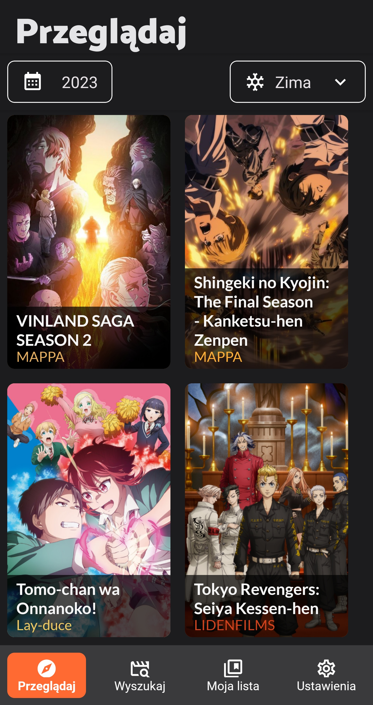
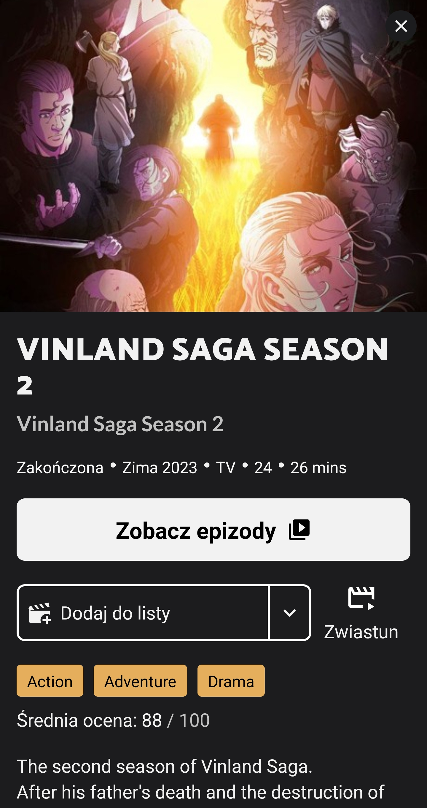
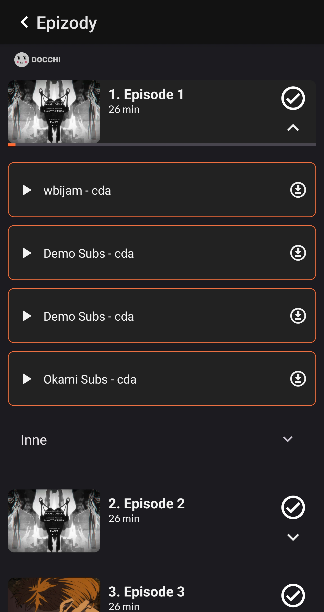
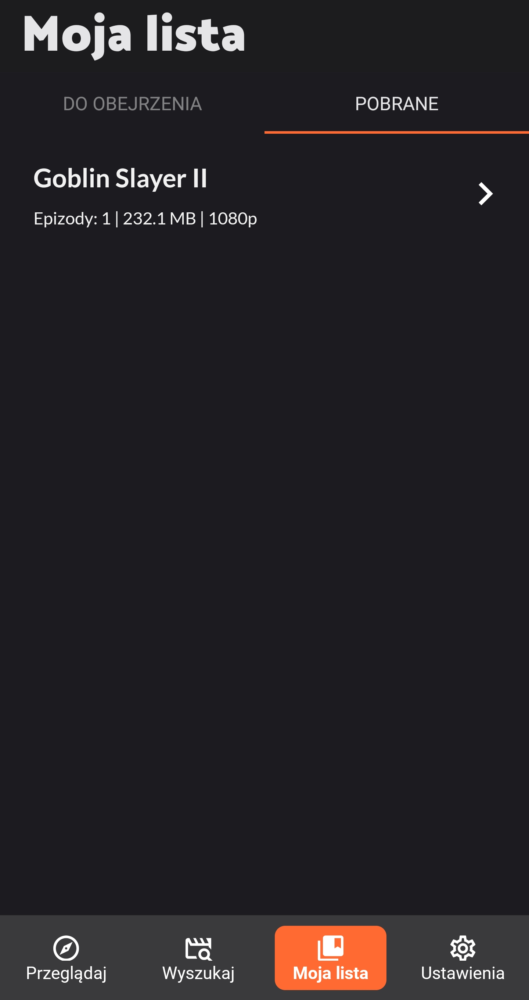
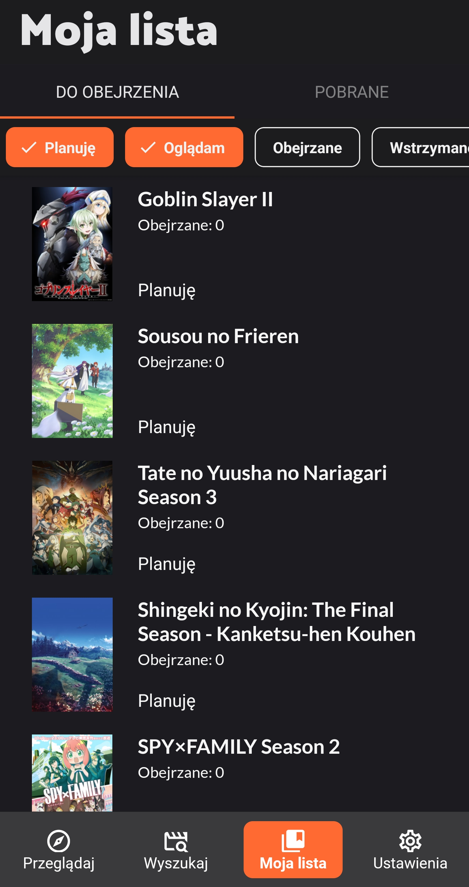

  

  Naikamu is an application that allows you to watch anime from Polish subs.

    <a href="https://naikamu.com">
        naikamu.com
    </a>

  
  

    
    
    
    
    

## About us

Naikamu is a dynamic and innovative team dedicated to the world of anime.
Its mission is to create, promote, and celebrate the art of anime in all its forms.
The name "Naikamu" is a fusion of two Japanese words: "nai" meaning "inside" and "kamu" meaning "to bring to life."
This reflects the team's core objective of bringing the rich and vibrant world of anime to life for fans and enthusiasts.

## Installation

To install this app go to [Releases](https://github.com/FezMLG/AniWatch/releases), download it, install and enjoy 🚀

## Contributing

Pull requests are welcome. For major changes, please open an issue first to discuss what you would like to change.

## License

[MIT](https://choosealicense.com/licenses/mit/)
